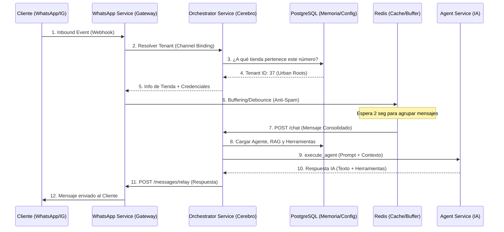

# Arquitecura de Flujo de Mensajes: El Camino del Dato (v7.5) 🗺️⚡

Este documento describe el ciclo de vida completo de un mensaje en **Platform AI Solutions**, desde que el cliente pulsa "Enviar" en WhatsApp hasta que recibe una respuesta inteligente del Agente.

## 1. Mapa Visual de Alto Nivel

---

## 2. Capas de Procesamiento

### A. Capa de Recepción (Gateway)
- **Servicio**: `whatsapp_service`
- **Función**: Valida firmas de seguridad de YCloud/Meta y resuelve el `tenant_id` llamando al Orchestrator.
- **Dato Crave**: El `channel_id` (número de teléfono o ID de inbox) es la llave maestra para encontrar la tienda en la tabla `channel_bindings`.

### B. Capa de Resolución (Orchestrator)
- **Servicio**: `orchestrator_service`
- **Función**: Es el "Traffic Controller". Busca en la base de datos la configuración de la tienda, los prompts del agente y las herramientas activas.
- **Templates**: Aquí es donde se inyecta el **System Prompt**. Si el agente es tipo `sales`, se usa el template de "Vendedor Maestro".

### C. Capa de Inteligencia (Agent Service)
- **Servicio**: `agent_service`
- **Función**: Construye el prompt final.
    - **Base**: Instrucciones del Agente.
    - **RAG**: Información del catálogo y PDF subidos.
    - **Inyecciones**: Guías de respuesta (Tone & Style).
- **Proceso**: Consulta a OpenAI/Gemini y genera la respuesta.

### D. Capa de Respuesta (Relay)
- **Servicio**: `whatsapp_service` (Endpoint `/messages/relay`)
- **Función**: Toma el texto de la IA y lo convierte en burbujas de WhatsApp. 
- **Fragmentación**: Si la respuesta es muy larga (>400 caracteres), el relay la divide automáticamente en múltiples mensajes naturales para que parezca una respuesta humana.

---

## 3. Resolución de Tiendas e Identificación (Multi-Tenant v7.5.2)

El sistema utiliza una **Jerarquía de Ruteo Híbrida** para garantizar que tanto canales legacy como nuevos (IG/FB) funcionen sin fricción:

1.  **Prioridad 1: Canal Vinculado (ID-Centric)**: Se busca en la tabla `channel_bindings` por el ID exacto del canal (ej: `inbox_id` de Chatwoot o `Page ID` de Meta). Si el canal es Chatwoot, se verifica además el `external_account_id` para máxima seguridad.
2.  **Prioridad 2: Fallback Legacy (Teléfono)**: Si no hay un vínculo explícito, el sistema limpia los dígitos del identificador y busca coincidencia con `tenants.bot_phone_number`.

> [!IMPORTANT]
> Esta arquitectura permite la omnicanalidad real: Instagram y Facebook se rutean por sus IDs internos, mientras que WhatsApp mantiene la compatibilidad por número de teléfono.

---

## 4. Ejemplo de un Mensaje "Urban Roots"

1. **Llega**: "Hola, tienen el fertilizante de 1L?" al número `5493...`.
2. **Mapping**: El Orchestrator ve que el `5493...` está anclado a la tienda `ID 37`.
3. **Contexto**: Se carga la personalidad de "Urban Roots", el catálogo de sustratos y las reglas de envío en Buenos Aires.
4. **Respuesta**: "¡Hola! Sí, el fertilizante de 1L está en stock a $XXXX. ¿Te lo envío a domicilio?"

---

> [!TIP]
> **Monitoreo**: Podés ver este flujo en tiempo real revisando los logs del `orchestrator_service` buscando el `correlation_id` que se genera al inicio de cada mensaje.
