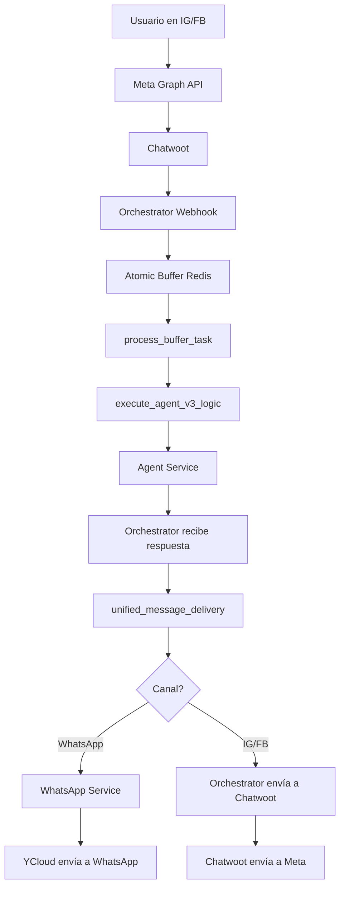
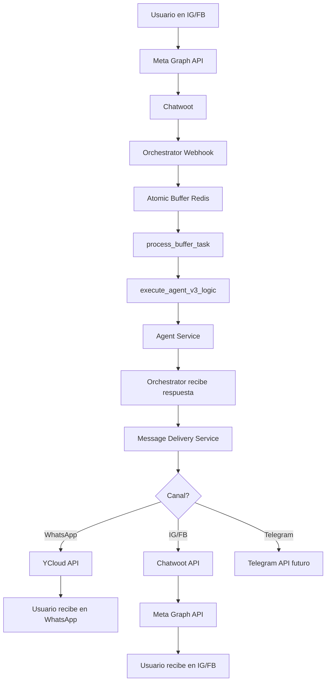
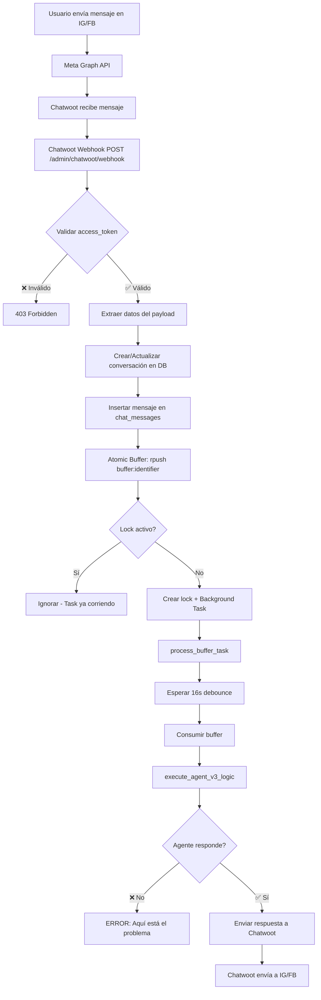

# Especificación Técnica: Fix Meta Channels No Response + Arquitectura Centralizada

**Fecha**: 2026-01-27 03:31 AM (UTC-3)  
**Prioridad**: 🔴 CRÍTICA  
**Tipo**: Bug Fix + Architectural Improvement  
**Afecta**: Instagram, Facebook, WhatsApp, Wizard de Prueba

---

## 1. Objetivos de Negocio

### Problema Principal
Los mensajes enviados a Instagram y Facebook **no reciben respuesta del agente IA**, aunque:
- ✅ El mensaje se recibe correctamente en el sistema
- ✅ El agente está activado
- ✅ Los canales IG/FB están habilitados en el agente
- ✅ El wizard de prueba funciona (pero con problema secundario)

### Problema Secundario
El wizard de prueba **devuelve JSON crudo** en lugar de solo la respuesta:
```json
{
  "thought": "User greeted casually. Respond warmly...",
  "response": "Holaaaa, qué bueno que estás por acá...",
  "tool_use": null
}
```

**Esperado**: Solo `"Holaaaa, qué bueno que estás por acá..."`

### Problema Arquitectónico (Descubierto)

**Duplicación de lógica**: El orchestrator está intentando replicar la lógica del WhatsApp Service para:
- Parsear formato especial del agente (`|||`, imágenes, burbujas múltiples)
- Simular comportamiento humano (delays entre mensajes)
- Enviar imágenes y media
- Gestionar rate limiting

**Consecuencia**: Código duplicado, inconsistencias entre canales, bugs difíciles de rastrear.

### Impacto
- 🔴 **Crítico**: Clientes en IG/FB no reciben respuestas → Pérdida de ventas
- 🟡 **Medio**: Wizard muestra JSON técnico → Confusión en testing
- 🟠 **Alto**: Duplicación de lógica → Mantenimiento costoso

---

## 2. Solución Propuesta: Arquitectura Centralizada

### 2.1 Renombrar WhatsApp Service → Message Delivery Service

**Nuevo rol**: Servicio universal de envío de mensajes salientes para TODOS los canales.

**Responsabilidades**:
1. ✅ Parsear formato especial del agente (`|||`, imágenes, delays)
2. ✅ Enviar mensajes a WhatsApp (YCloud)
3. ✅ Enviar mensajes a Chatwoot (que rutea a IG/FB)
4. ✅ Simular comportamiento humano (delays, typing indicators)
5. ✅ Gestionar rate limiting por canal
6. ✅ Retry logic para fallos de envío

### 2.2 Flujo Actual (Problemático)



**Problema**: Lógica de parseo y envío duplicada en Orchestrator y WhatsApp Service.

### 2.3 Flujo Propuesto (Centralizado)



**Beneficio**: Una sola implementación de la lógica de parseo y envío.

---

## 3. Cambios Propuestos

### Fase 1: Fix Inmediato (Ya Implementado)

✅ **Fix 1**: Try-except para import de `process_buffer_task` en `admin_routes.py`  
✅ **Fix 2**: Función `extract_response_from_agent_output()` en `main.py`  
✅ **Fix 3**: Logging detallado en webhook y process_buffer_task

**Resultado**: Instagram y Facebook deberían recibir respuestas (sin formato especial del agente).

### Fase 2: Centralización (Recomendado)

#### 2.1 Renombrar Servicio

**Archivo**: `docker-compose.yml`

```yaml
# ANTES
whatsapp_service:
  build: ./whatsapp_service
  
# DESPUÉS
message_delivery_service:
  build: ./message_delivery_service  # Renombrar carpeta
```

#### 2.2 Actualizar Message Delivery Service

**Archivo**: `message_delivery_service/main.py` (antes `whatsapp_service/main.py`)

**Agregar endpoint universal**:

```python
@app.post("/v1/send")
async def send_message_universal(request: SendMessageRequest):
    """
    Endpoint universal para enviar mensajes a cualquier canal.
    
    Args:
        request: {
            "channel": "whatsapp" | "instagram" | "facebook",
            "tenant_id": int,
            "conversation_id": str,
            "phone_or_identifier": str,
            "content": str,  # Formato especial del agente (|||, imágenes, etc.)
            "chatwoot_conv_id": int (opcional, solo para IG/FB),
            "chatwoot_account_id": int (opcional, solo para IG/FB)
        }
    
    Returns:
        {"status": "sent", "parts_sent": 3}
    """
    # 1. Parsear formato especial del agente (LÓGICA ÚNICA)
    parts = parse_agent_response(request.content)
    
    # 2. Enviar según canal
    if request.channel == "whatsapp":
        await send_to_ycloud(request.phone_or_identifier, parts)
    elif request.channel in ["instagram", "facebook"]:
        await send_to_chatwoot(
            request.chatwoot_conv_id,
            request.chatwoot_account_id,
            parts
        )
    
    return {"status": "sent", "parts_sent": len(parts)}
```

#### 2.3 Actualizar Orchestrator

**Archivo**: `orchestrator_service/main.py`

**Cambio en `unified_message_delivery`**:

```python
async def unified_message_delivery(tenant_id, conv_id, phone, text, channel, correlation_id):
    """
    ANTES: Lógica duplicada para cada canal
    DESPUÉS: Delegar TODO al Message Delivery Service
    """
    # Obtener metadata de Chatwoot si es IG/FB
    chatwoot_conv_id = None
    chatwoot_account_id = None
    
    if channel in ["instagram", "facebook"]:
        conv_row = await db.pool.fetchrow("""
            SELECT external_chatwoot_id, external_account_id 
            FROM chat_conversations WHERE id = $1
        """, conv_id)
        
        if conv_row:
            chatwoot_conv_id = conv_row['external_chatwoot_id']
            chatwoot_account_id = conv_row['external_account_id']
    
    # Llamar al Message Delivery Service (UNIVERSAL)
    message_delivery_url = os.getenv("MESSAGE_DELIVERY_SERVICE_URL", "http://message_delivery_service:8002")
    
    async with httpx.AsyncClient(timeout=30.0) as client:
        response = await client.post(
            f"{message_delivery_url}/v1/send",
            json={
                "channel": channel,
                "tenant_id": tenant_id,
                "conversation_id": conv_id,
                "phone_or_identifier": phone,
                "content": text,  # Formato especial del agente (sin parsear)
                "chatwoot_conv_id": chatwoot_conv_id,
                "chatwoot_account_id": chatwoot_account_id
            },
            headers={"X-Internal-Secret": INTERNAL_SECRET_KEY}
        )
        response.raise_for_status()
        
    logger.info(f"✅ Message sent via Message Delivery Service | channel={channel} | conv={conv_id}")
```

---

## 4. Beneficios de la Centralización

| Aspecto | Antes (Duplicado) | Después (Centralizado) |
|---------|-------------------|------------------------|
| **Parseo de `|||`** | 2 implementaciones | 1 implementación |
| **Envío de imágenes** | 2 implementaciones | 1 implementación |
| **Delays entre mensajes** | 2 implementaciones | 1 implementación |
| **Rate limiting** | 2 implementaciones | 1 implementación |
| **Retry logic** | 2 implementaciones | 1 implementación |
| **Mantenimiento** | 2x esfuerzo | 1x esfuerzo |
| **Bugs** | Difíciles de rastrear | Fáciles de rastrear |
| **Nuevos canales** | Duplicar lógica | Agregar case en switch |

---

## 5. Plan de Implementación

### Opción A: Fix Rápido (Ya Implementado)

✅ Implementar Fixes 1, 2 y 3  
✅ Probar en staging  
✅ Desplegar a producción  

**Tiempo**: 1 hora  
**Riesgo**: Bajo  
**Resultado**: IG/FB funcionan, pero sin formato especial del agente

### Opción B: Centralización Completa (Recomendado)

1. ✅ Implementar Fixes 1, 2 y 3 (ya hecho)
2. ⏳ Renombrar `whatsapp_service` → `message_delivery_service`
3. ⏳ Agregar endpoint `/v1/send` universal
4. ⏳ Actualizar `unified_message_delivery` en orchestrator
5. ⏳ Probar en staging
6. ⏳ Desplegar a producción

**Tiempo**: 4-6 horas  
**Riesgo**: Medio  
**Resultado**: IG/FB funcionan CON formato especial del agente (burbujas, imágenes, delays)

---

## 6. Recomendación

**Implementar Opción A ahora** (ya hecho) para resolver el problema urgente.

**Implementar Opción B después** como mejora arquitectónica para:
- Eliminar duplicación de código
- Garantizar consistencia entre canales
- Facilitar agregar nuevos canales (Telegram, SMS, etc.)

---

## 7. Criterios de Aceptación

### Must Have (Opción A - Ya Implementado)
1. ✅ Mensajes de Instagram reciben respuesta del agente
2. ✅ Mensajes de Facebook reciben respuesta del agente
3. ✅ Wizard de prueba muestra solo el texto de respuesta (sin JSON)
4. ✅ Logs estructurados muestran cada paso del flujo

### Should Have (Opción B - Futuro)
5. ⏳ Formato especial del agente funciona en IG/FB (|||, imágenes, delays)
6. ⏳ Message Delivery Service maneja TODOS los canales
7. ⏳ Código duplicado eliminado del orchestrator

---

**Última actualización**: 2026-01-27 03:31 AM (UTC-3)  
**Autor**: Antigravity (Spec Architect)  
**Estado**: Fase 1 implementada, Fase 2 pendiente de aprobación


---

## 1. Objetivos de Negocio

### Problema Principal
Los mensajes enviados a Instagram y Facebook **no reciben respuesta del agente IA**, aunque:
- ✅ El mensaje se recibe correctamente en el sistema
- ✅ El agente está activado
- ✅ Los canales IG/FB están habilitados en el agente
- ✅ El wizard de prueba funciona (pero con problema secundario)

### Problema Secundario
El wizard de prueba **devuelve JSON crudo** en lugar de solo la respuesta:
```json
{
  "thought": "User greeted casually. Respond warmly...",
  "response": "Holaaaa, qué bueno que estás por acá...",
  "tool_use": null
}
```

**Esperado**: Solo `"Holaaaa, qué bueno que estás por acá..."`

### Impacto
- 🔴 **Crítico**: Clientes en IG/FB no reciben respuestas → Pérdida de ventas
- 🟡 **Medio**: Wizard muestra JSON técnico → Confusión en testing

---

## 2. Análisis Técnico

### 2.1 Flujo Actual (Instagram/Facebook)



### 2.2 Hipótesis del Problema

**Hipótesis 1**: El agente no se está disparando porque:
- El `tenant_id` no se está pasando correctamente a `process_buffer_task`
- El `identifier` no coincide con el esperado por el agente
- El canal `nexus_channel` no se está mapeando correctamente

**Hipótesis 2**: El agente se dispara pero la respuesta no se envía porque:
- El JSON con `{"thought": ..., "response": ...}` no se está parseando
- La respuesta se está enviando pero Chatwoot no la recibe
- El `external_chatwoot_id` o `external_account_id` son incorrectos

**Hipótesis 3**: El wizard funciona porque:
- Usa un endpoint diferente que no pasa por Chatwoot
- No tiene el problema de parsing del JSON

### 2.3 Código Relevante

**Archivo**: `orchestrator_service/admin_routes.py`  
**Líneas**: 4933-5150 (Webhook de Chatwoot)

**Problema identificado en línea 5136**:
```python
from main import process_buffer_task # Import dynamically
```

**Problema**: Este import puede fallar si `main.py` no exporta `process_buffer_task` correctamente.

---

## 3. Esquemas de Datos

### 3.1 Payload de Chatwoot Webhook (Instagram)

```json
{
  "event": "message_created",
  "message_type": "incoming",
  "content": "Hola",
  "private": false,
  "conversation": {
    "id": 123,
    "channel": "Channel::Instagram",
    "meta": {
      "sender": {
        "id": 456,
        "name": "Cliente IG",
        "thumbnail": "https://..."
      }
    }
  },
  "sender": {
    "id": 456,
    "name": "Cliente IG",
    "additional_attributes": {
      "social_profiles": {
        "instagram": "@cliente_ig"
      }
    }
  },
  "account": {
    "id": 1
  },
  "attachments": []
}
```

### 3.2 Respuesta Esperada del Agente

**Formato actual** (JSON crudo):
```json
{
  "thought": "User greeted casually...",
  "response": "Holaaaa, qué bueno que estás por acá...",
  "tool_use": null
}
```

**Formato esperado** (solo texto):
```
Holaaaa, qué bueno que estás por acá, contame: buscás zapatillas de punta...
```

---

## 4. Lógica de Negocio (Gherkin)

### Escenario 1: Usuario envía mensaje en Instagram

```gherkin
Dado que un usuario envía "Hola" en Instagram
Y el agente está activado con canal "instagram" habilitado
Cuando Chatwoot recibe el mensaje y dispara el webhook
Entonces el sistema debe:
  1. Validar el access_token
  2. Extraer el identifier del usuario (ej: "@cliente_ig")
  3. Crear/actualizar la conversación en chat_conversations
  4. Insertar el mensaje en chat_messages con role='user'
  5. Agregar el mensaje al buffer Redis
  6. Disparar process_buffer_task en background
  7. Esperar 16s de debounce
  8. Consumir el buffer y llamar a execute_agent_v3_logic
  9. El agente debe generar una respuesta
  10. Extraer SOLO el campo "response" del JSON
  11. Enviar la respuesta a Chatwoot API
  12. Chatwoot envía la respuesta a Instagram
Y el usuario debe recibir la respuesta en Instagram
```

### Escenario 2: Wizard de prueba

```gherkin
Dado que un usuario usa el wizard de prueba
Cuando envía un mensaje de prueba
Entonces el sistema debe:
  1. Llamar al agente directamente (sin Chatwoot)
  2. El agente genera respuesta en formato JSON
  3. Extraer SOLO el campo "response" del JSON
  4. Mostrar solo el texto de respuesta en el wizard
Y NO debe mostrar "thought" ni "tool_use"
```

---

## 5. Stack Tecnológico

### Backend
- **Framework**: FastAPI (Python 3.11+)
- **Database**: PostgreSQL (asyncpg)
- **Cache**: Redis (para Atomic Buffer)
- **AI**: OpenAI GPT-4o / Google Gemini

### Integraciones
- **Chatwoot**: Webhook receiver + API client
- **Meta Graph API**: Instagram + Facebook
- **WhatsApp**: YCloud (no afectado por este bug)

### Archivos Afectados
1. `orchestrator_service/admin_routes.py` - Webhook de Chatwoot
2. `orchestrator_service/main.py` - `process_buffer_task` y `execute_agent_v3_logic`
3. `frontend_react/src/components/AgentWizard.tsx` - Wizard de prueba (si existe)

---

## 6. Criterios de Aceptación

### Must Have (Crítico)
1. ✅ Mensajes de Instagram reciben respuesta del agente
2. ✅ Mensajes de Facebook reciben respuesta del agente
3. ✅ Wizard de prueba muestra solo el texto de respuesta (sin JSON)
4. ✅ Logs estructurados muestran cada paso del flujo
5. ✅ No hay errores en consola de orchestrator-service

### Should Have (Importante)
6. ✅ Timeout de 60s para respuestas del agente
7. ✅ Retry automático si Chatwoot API falla (1 retry)
8. ✅ Mensaje de error al usuario si el agente falla después de retry

### Nice to Have (Opcional)
9. ⚪ Dashboard muestra estado de procesamiento en tiempo real
10. ⚪ Métricas de latencia por canal (IG vs FB vs WA)

---

## 7. Plan de Investigación (Debugging)

### Paso 1: Verificar que el webhook se está llamando

```bash
# En logs de orchestrator-service, buscar:
grep "WEBHOOK DEBUG: Raw Channel" logs/orchestrator.log

# Debe mostrar:
# WEBHOOK DEBUG: Raw Channel='Channel::Instagram'
# WEBHOOK DEBUG: Raw Channel='Channel::Facebook'
```

### Paso 2: Verificar que el buffer se está llenando

```bash
# En Redis, verificar:
redis-cli
> KEYS buffer:*
> LRANGE buffer:@cliente_ig 0 -1

# Debe mostrar los mensajes del usuario
```

### Paso 3: Verificar que process_buffer_task se está ejecutando

```bash
# En logs, buscar:
grep "🤖 AI ENGINE STARTED" logs/orchestrator.log

# Debe mostrar:
# 🤖 AI ENGINE STARTED | from=@cliente_ig | tenant=1 | conv=uuid-123
```

### Paso 4: Verificar que el agente responde

```bash
# En logs, buscar:
grep "response" logs/orchestrator.log

# Debe mostrar el JSON con "response": "..."
```

### Paso 5: Verificar que se envía a Chatwoot

```bash
# En logs, buscar:
grep "chatwoot_delivery_attempt" logs/orchestrator.log

# Debe mostrar el intento de envío
```

---

## 8. Solución Propuesta

### Fix 1: Asegurar que process_buffer_task se ejecuta

**Problema**: Import dinámico puede fallar

**Solución**:
```python
# En admin_routes.py, línea 5136
try:
    from main import process_buffer_task
except ImportError:
    logger.error("CRITICAL: Cannot import process_buffer_task from main.py")
    return {"status": "error", "reason": "import_failed"}
```

### Fix 2: Extraer solo "response" del JSON

**Problema**: El agente devuelve JSON completo

**Solución**: En `main.py`, después de que el agente responde:
```python
# Si la respuesta es JSON, extraer solo el campo "response"
if isinstance(agent_response, dict):
    final_response = agent_response.get("response", str(agent_response))
elif isinstance(agent_response, str):
    try:
        parsed = json.loads(agent_response)
        final_response = parsed.get("response", agent_response)
    except:
        final_response = agent_response
else:
    final_response = str(agent_response)

# Enviar final_response a Chatwoot
```

### Fix 3: Logging detallado

**Solución**: Agregar logs en cada paso:
```python
logger.info(f"WEBHOOK: Received message from {nexus_channel} | identifier={identifier}")
logger.info(f"BUFFER: Added to buffer:{identifier} | content={data[:50]}")
logger.info(f"TASK: Starting process_buffer_task | identifier={identifier}")
logger.info(f"AGENT: Response generated | length={len(final_response)}")
logger.info(f"CHATWOOT: Sending to conversation_id={chatwoot_conv_id}")
```

---

## 9. Testing Plan

### Test 1: Instagram Message Flow
```python
# Simular webhook de Chatwoot con mensaje de Instagram
payload = {
    "event": "message_created",
    "message_type": "incoming",
    "content": "Hola",
    "conversation": {
        "id": 123,
        "channel": "Channel::Instagram",
        "meta": {"sender": {"id": 456, "name": "Test User"}}
    },
    "sender": {
        "id": 456,
        "name": "Test User",
        "additional_attributes": {
            "social_profiles": {"instagram": "@test_user"}
        }
    },
    "account": {"id": 1}
}

response = await client.post(
    "/admin/chatwoot/webhook?access_token=VALID_TOKEN",
    json=payload
)

assert response.status_code == 200
# Esperar 20s (16s debounce + 4s procesamiento)
await asyncio.sleep(20)

# Verificar que se envió respuesta a Chatwoot
# (Requiere mock de Chatwoot API)
```

### Test 2: Wizard Response Format
```python
# Simular llamada al wizard
response = await client.post(
    "/admin/agents/test",
    json={"message": "Hola", "agent_id": "uuid-123"}
)

assert response.status_code == 200
data = response.json()

# Verificar que NO contiene "thought" ni "tool_use"
assert "thought" not in data["response"]
assert "tool_use" not in data["response"]

# Verificar que es solo texto
assert isinstance(data["response"], str)
```

---

## 10. Rollback Plan

Si el fix causa problemas:

1. **Revertir cambios en main.py**:
   ```bash
   git revert <commit_hash>
   ```

2. **Reiniciar orchestrator-service**:
   ```bash
   docker-compose restart orchestrator-service
   ```

3. **Verificar que WhatsApp sigue funcionando** (no debe afectarse)

---

## 11. Próximos Pasos

1. ✅ Revisar esta especificación con el usuario
2. ⏳ Implementar Fix 1, 2 y 3
3. ⏳ Ejecutar Test 1 y 2
4. ⏳ Desplegar a staging
5. ⏳ Probar en Instagram y Facebook reales
6. ⏳ Desplegar a producción
7. ⏳ Monitorear logs por 24h

---

**Última actualización**: 2026-01-27 03:25 AM (UTC-3)  
**Autor**: Antigravity (Spec Architect)  
**Requiere aprobación**: ✅ SÍ (Usuario debe confirmar antes de implementar)
