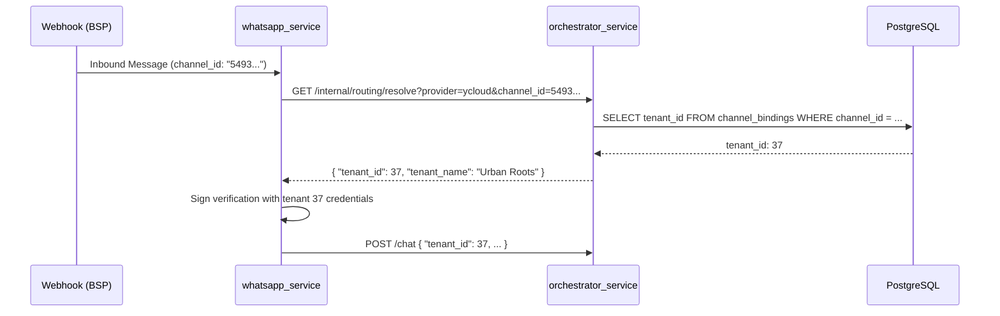

# Especificación Técnica: Canales Multi-Tienda (v7.5)

El sistema debe permitir que un usuario gestione múltiples tiendas y asocie diferentes canales de comunicación (WhatsApp, Meta, etc.) a cada una de ellas de forma independiente.

## 1. Objetivos de Negocio
- **Flexibilidad**: Permitir que un usuario (Owner) asocie canales existentes a cualquier tienda que posea.
- **Robustez**: Evitar la duplicación automática de canales durante el reinicio del servidor.
- **Trazabilidad**: Identificar claramente a qué tienda pertenece cada canal en la interfaz de administración.

## 2. Esquema de Datos y Ruteo

### 2.1 Flujo de Resolución de Tenant (Inbound)

## 3. Lógica de Negocio (SDD)

### Escenario 1: Asociación de Canal
**Dado** un usuario con dos tiendas: "Urban Roots" (ID 37) y "Pointe Coach" (ID 1).
**Cuando** el usuario edita un canal de YCloud y selecciona "Urban Roots" en el selector.
**Entonces** el sistema actualiza la fila correspondiente en `channel_bindings` con `tenant_id = 37`.

### Escenario 2: Prevención de Duplicados
**Dado** que ya existen registros en la tabla `channel_bindings`.
**Cuando** el Orchestrator se reinicia.
**Entonces** la migración #32 no debe ejecutarse si detecta que el canal ya existe o si el usuario ha optado por el nuevo sistema multi-tenant.

## 4. Cambios Técnicos

### Backend (`orchestrator_service`)
- **Fix Migración**: Modificar el SQL de migración en `main.py` para que sea idempotente y no dependa ciegamente de `tenants.bot_phone_number`.
- **Refactor `admin_routes.py`**:
    - Actualizar `edit_channel` para aceptar `tenant_id`.
    - Actualizar `list_channel_bindings` para devolver el `tenant_name` mediante un JOIN con `tenants`.

### Frontend (`frontend_react`)
- **Channels View**:
    - Añadir hook `useFetch('/admin/tenants')` para obtener la lista de tiendas.
    - Implementar selector `<select>` en el modal de canal.
    - Actualizar estado de `formData` para incluir `tenant_id`.

## 5. Criterios de Aceptación
1. [ ] Al editar un canal, se debe poder cambiar la tienda asociada.
2. [ ] La lista de canales debe mostrar el nombre de la tienda (ej: "WhatsApp YCloud -> Urban Roots").
3. [ ] Reiniciar el servidor no genera filas duplicadas en `channel_bindings`.
4. [ ] El ruteo de `whatsapp_service` sigue funcionando correctamente para mensajes entrantes y salientes.
